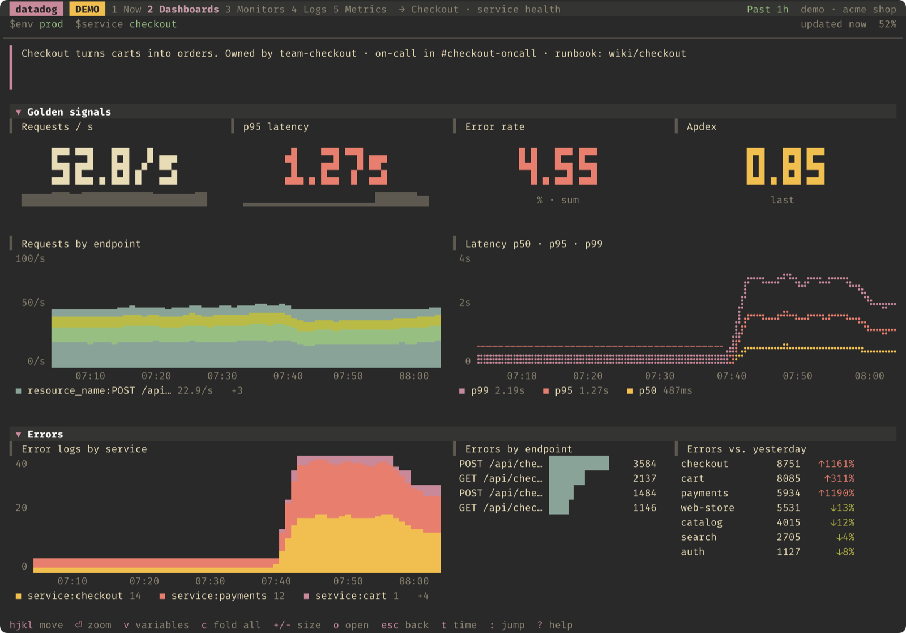
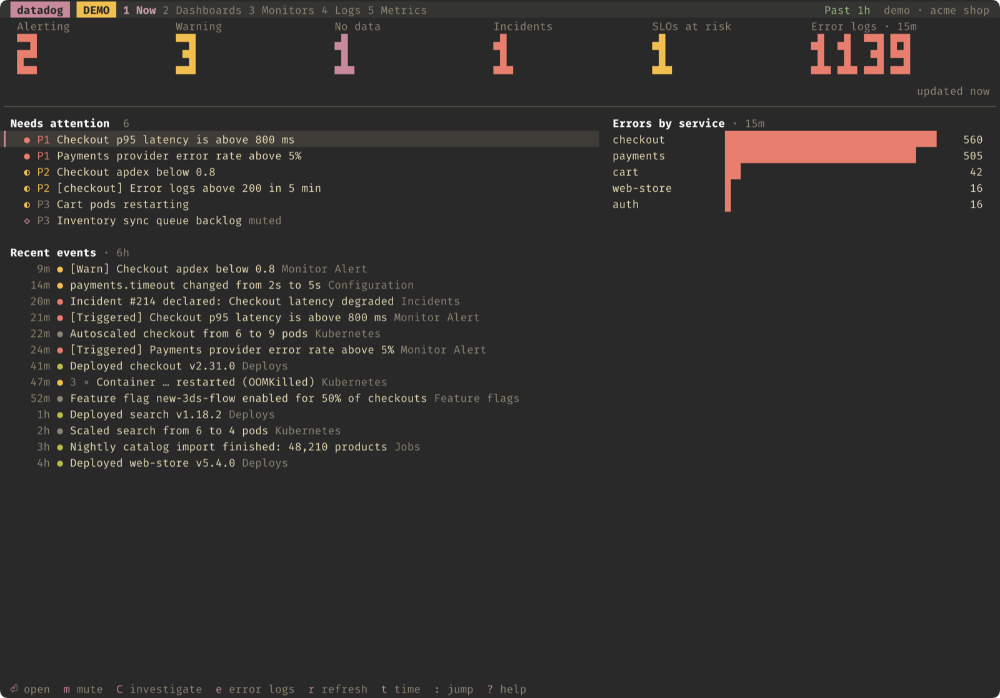
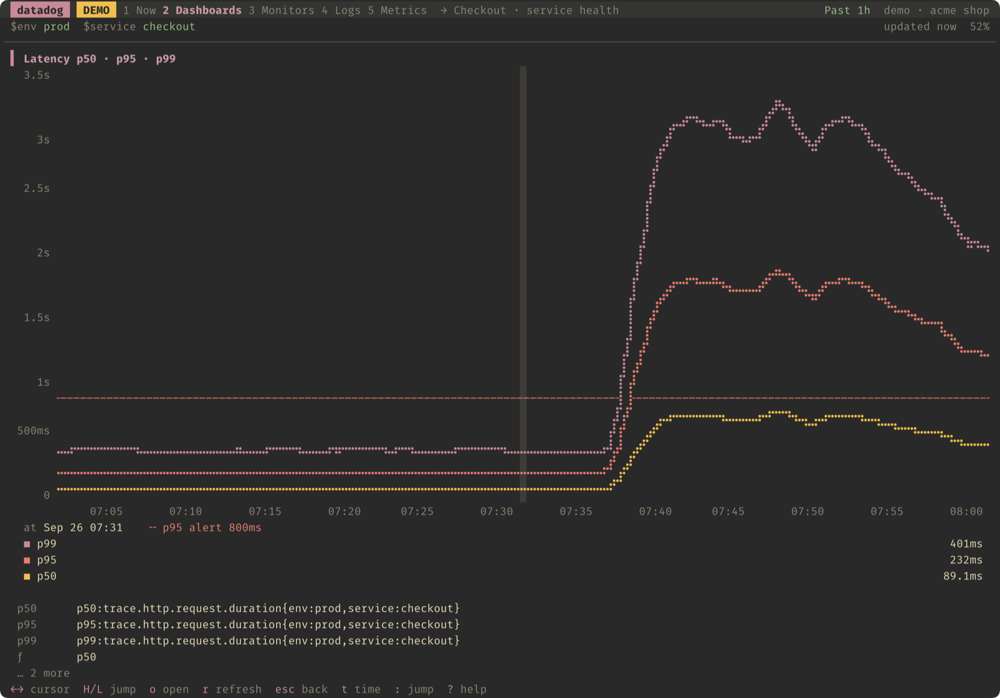
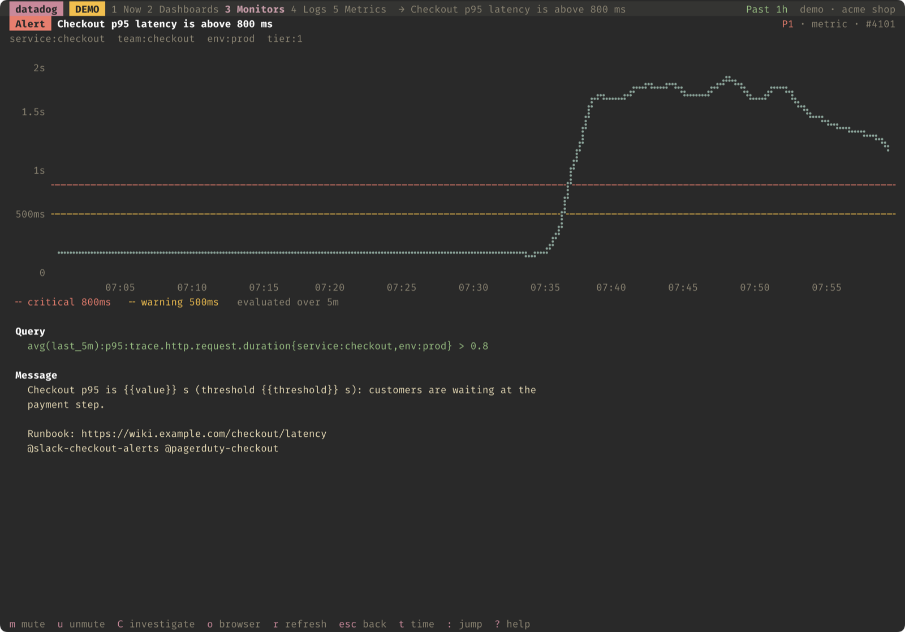
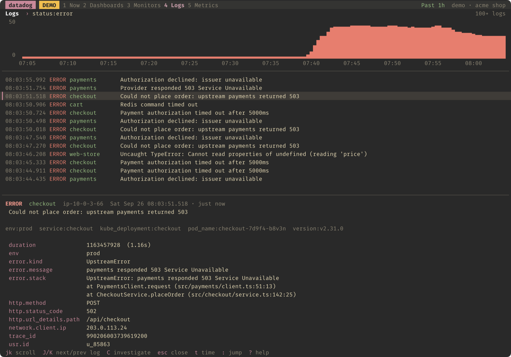
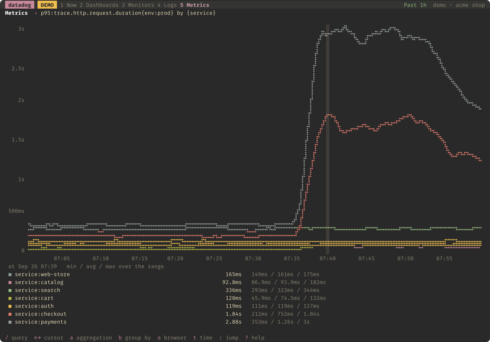

<h1 align="center">datadog</h1>

<p align="center"><strong>Datadog in your terminal — for you, your scripts and your AI agents.</strong><br>
A fast terminal UI that draws dashboards the way Datadog does, and a CLI built for automation: a stable output contract on every command, and commands that read Datadog into facts an agent can reason about.</p>

<p align="center">
  <a href="https://github.com/ngavilan-dogfy/datadog-cli/releases/latest"></a>
  <a href="https://github.com/ngavilan-dogfy/datadog-cli/actions/workflows/ci.yml"></a>
  
  <a href="LICENSE"></a>
</p>

<p align="center">
  
</p>

| For you | For scripts | For agents |
|---|---|---|
| `datadog ui`: your dashboards on Datadog's grid, monitors grouped by state, logs that tail live and a metrics explorer, refreshing on their own. | One output contract everywhere: tables in a terminal, TSV in a pipe, JSON with `--json`, errors on stderr, a non-zero exit on failure. | Questions in plain words: `datadog investigate checkout` correlates everything into a report with references. Commands that read Datadog into facts — any link, a trace, a chart, a dashboard, thousands of logs — and a Claude Code skill that knows when to use each. |

## Install

```bash
curl -fsSL https://raw.githubusercontent.com/ngavilan-dogfy/datadog-cli/main/install.sh | sh
```

The installer picks the build for your OS and CPU, verifies it against the release's `checksums.txt`, and installs it to `~/.local/bin` without sudo. It then offers — never assumes — to add that folder to your `PATH`, to install the `/datadog` skill if you use Claude Code, and to run `datadog setup`. Running it again updates in place.

No keys yet? `datadog ui --demo` opens a made-up web store whose checkout is having a bad afternoon. Nothing leaves your machine.

<details>
<summary><strong>Other ways to install, and uninstalling</strong></summary>

- **A specific version or folder**: `curl -fsSL …/install.sh | DATADOG_VERSION=v1.2.0 DATADOG_INSTALL_DIR=~/bin sh`. `DATADOG_NO_SETUP=1`, `DATADOG_NO_SKILL=1` and `DATADOG_NO_MODIFY_PATH=1` keep it from asking.
- **With Go** (1.25+): `go install github.com/ngavilan-dogfy/datadog-cli/cmd/datadog@latest`
- **By hand**: download `datadog-<os>-<arch>` from the [latest release](https://github.com/ngavilan-dogfy/datadog-cli/releases/latest), check it against `checksums.txt`, make it executable and put it on your `PATH`. On Windows: `datadog-windows-amd64.exe`.
- **From source**: `make install` builds and copies it to `~/.local/bin`.
- **Uninstall**: `rm ~/.local/bin/datadog`; `rm -rf ~/.config/datadog-cli` also removes your profiles and keys; `datadog skill remove` removes the Claude Code skill.

</details>

## Set up

```bash
datadog setup
```

<p align="center"></p>

Setup takes about a minute and checks every answer against Datadog before moving on:

1. **Site** — pick your region, or paste any Datadog link and the site is read from it.
2. **API key** — setup opens the right settings page and says what to click. Click **Copy** on a key and setup takes it from the clipboard; there is nothing to paste. A key that belongs to another region is caught and the right site is offered. Without admin rights, it tells you what to ask an admin for.
3. **Application key** — the same, on your personal settings, where anyone can create one. Setup reports whose key it is and which products it can read, so a scoped key doesn't fail silently later.
4. **Extras** — the chart style your font can draw, whether this profile may change things in Datadog or only read, and the Claude Code skill.

Nothing is saved until the end. Keys are written to `~/.config/datadog-cli/profiles/<profile>.yaml`, readable only by you, and cleared from the clipboard once saved. `datadog doctor` re-checks everything and prints a fix for each problem it finds.

In CI and containers there is nothing to set up: `DD_API_KEY`, `DD_APP_KEY` and `DD_SITE` are enough.

## The terminal UI

`datadog ui` has five tabs. Everything loads in parallel; *Now*, dashboards and monitors refresh every minute, and logs tail live.

| | |
|---|---|
| **Now** — is anything wrong right now? What's alerting, open incidents, SLOs at risk, which services are logging errors and what changed recently, with repeated events folded into one line. |  |
| **Dashboards** — laid out on Datadog's 12-column grid: time series, query values, top lists, change widgets, notes, groups, log streams and monitor summaries, with template variables (`v`) and one time range for all of them (`t`). |  |
| **Zoom** — `⏎` on a widget fills the screen; `←` `→` move a cursor that reads exact values, and the queries are listed below. |  |
| **Monitors** — grouped by state, P1 first. A monitor's page charts what it watches against its thresholds, lists its groups and renders the message as it reads in the current state. `m` mutes for a while, `u` unmutes. |  |
| **Logs** — volume by status over time, the matching lines, and a detail view with every attribute and the stack trace. `L` tails live, `s` narrows to the log's service. |  |
| **Metrics** — type a metric (`tab` completes), then change the space aggregation with `a` and the grouping with `b`. |  |

`:` or `Ctrl+K` jumps anywhere; `o` opens what you're looking at in Datadog; on a monitor or a log, `C` hands it to Claude Code with the commands to dig further. `datadog ui <dashboard-id or link>` opens a dashboard directly, and `datadog ui --file draft.json` previews a dashboard that doesn't exist yet, reloading it every time the file is saved.

Charts are drawn with braille dots, which are finer, or with blocks, which work in any font. `B` switches between them and the choice is remembered.

<details>
<summary><strong>Keyboard reference</strong></summary>

| Key | Where | Action |
|---|---|---|
| `1`–`5`, `Tab` | everywhere | Now · Dashboards · Monitors · Logs · Metrics |
| `:` / `Ctrl+K` | everywhere | Jump to a dashboard, monitor or tab |
| `t` | everywhere | Time range |
| `B` | everywhere | Braille or block charts |
| `?` | everywhere | Every key for the current screen |
| `q` / `Esc` | everywhere | Back, or quit |
| `h` `j` `k` `l` / arrows | dashboard | Move between widgets |
| `⏎` | dashboard | Zoom a widget, fold a group |
| `v` | dashboard | Template variables |
| `c` / `+` `-` | dashboard | Fold every group / denser or roomier layout |
| `←` `→`, `H` `L` | zoomed chart | Move the cursor, jump further |
| `m` / `u` | monitors | Mute for a while / unmute |
| `/` | lists, logs, metrics | Filter, or edit the query |
| `L` / `s` / `n` | logs | Live tail / only this service / load more |
| `a` / `b` | metrics | Space aggregation / group by |
| `C` | monitor, log | Investigate with Claude Code |
| `o` | anywhere | Open in Datadog |

</details>

## Asking it questions

People ask *why is checkout failing since this morning?*, not `sum:trace.http.request.errors{service:checkout}`. Three commands start from the question and do the correlating:

```console
$ datadog investigate checkout --since "today 09:00" --question "why is checkout failing since this morning?"
 Investigation · checkout (env:prod) · Sep 24 09:00 → 11:00 CEST
 status: degraded · started 09:30 · compared with 1d before (Sep 23 09:00 → 11:00 CEST)

 Summary
   checkout: errors ×37.7 at 09:30 (0.2% → 7.5% of requests); error logs ×33.3 (5,000, 1d before: 150). Most
   likely (high confidence): a change 5 min before it started: checkout: new instance web-3 (deploy, restart
   or scale-out). "checkout error rate" alerted 20 min after it started.

 Timeline (CEST)
   09:25  deploy   checkout: new instance web-3 (deploy, restart or scale-out) [4]
   09:30  logs     checkout: new error "payment authorization timed out after <num>ms" first logged [6]
   09:30  onset    checkout: errors ×37.7 at 09:30 (0.2% → 7.5% of requests); error logs ×33.3 (5,000, 1d
                   before: 150)
   09:50  alert    monitor "checkout error rate" OK → Alert [7]

 Leads
   1. [high] A change 5 min before it started: checkout: new instance web-3 (deploy, restart or scale-out) [4]
      + checkout: new instance web-3 (deploy, restart or scale-out) at 09:25, and the trouble started at 09:30
   2. [high] The failure says: "payment authorization timed out after <num>ms" [6]
   3. [medium] It's one endpoint: POST /orders [3]
 …
```

| `datadog …` | What it answers |
|---|---|
| `find <words…>` | What are these words in Datadog? The services, endpoints, operations, monitors, dashboards, SLOs, incidents, metrics and hosts they match, best first, each with the command that reads it. Typos and plurals are fine. |
| `investigate <service>` | Why is it failing — or is it? Traffic, errors and latency against the day before (the week before for longer windows); when it started; the endpoints and dependencies behind it; error logs that are new or grew; the process and its hosts (event loop, GC, CPU, memory); and everything that changed before it: new instances and versions, deploys, resource and configuration changes, alerts. Then leads ranked by confidence with the evidence for and against, what was checked and found normal, what couldn't be checked, the monitors that would have caught it sooner, and the next commands to run. A service name, an endpoint (`--resource`) or plain words (`datadog investigate payments checkout`) all work. |
| `monitors review` | Are the monitors any good? Each monitor next to what it did in the last 30 days: the ones that notify no one, sit in Alert or No Data for days, watch a floor but go quiet when traffic stops completely, flap, never remind, judge cloud metrics before they arrive, never came close to their threshold, were made from a template and never filled in, or are muted with no end. Each finding comes with the `datadog monitors edit` command that fixes it. |
| `events search <query>` | What changed, what fired? Monitor transitions, deploys and resource changes (a new Cloud Run revision, a configuration change), in one list. |

**Times as people say them.** Every analysis command takes `--since 2h`, `--since yesterday`, `--from "yesterday 18:00" --to "today 09:00"` or `--around "today 09:40" --window 1h`, in English or Spanish (`"ayer a las 18:00"`, `"hace 2h"`, `"el lunes"`).

**Reports with references.** `--md` writes a report for a ticket or a thread; `--json` gives an agent every fact. Each claim cites a numbered reference: a link to the exact Datadog view, with the same window and the query behind it. `datadog read <link>` reads any reference back, so an agent can check a claim before repeating it.

**Improvements, not changes.** `investigate` suggests the monitors that were missing or late, and `monitors review` proposes fixes as commands:

```console
$ datadog monitors review --service checkout
 Monitors review · the monitors of checkout · Aug 28 14:00 → Sep 27 14:00 CEST
 5 monitors · 6 alerts in the window · 2 to fix · 1 worth a look · 1 to tidy · 1 fine

 To fix
   ✗ [P1] checkout traffic below 100 requests/15m #119 · OK · 0 alerts · data 2400–38k over 7d
     Watches a floor, but goes quiet when there's nothing at all — when requests (or whatever it counts) stop
       completely the metric disappears instead of reaching zero: the monitor sees no data and tells no one —
       the worst outage looks like silence
       fix:   datadog monitors edit 119 --option on_missing_data=show_and_notify_no_data

 Worth a look
   ! checkout p95 latency #204 · OK · 6 alerts (18 min alerting)
     Flaps: 6 alerts in 30d, 6 over within 15 minutes — an alert that's over before anyone looks is noise; a
       recovery threshold short of the alert one, or a longer window, waits until it's real
       fix:   datadog monitors edit 204 --threshold critical_recovery=0.64
       check: datadog monitors explain 204 --since 7d
 …
```

Nothing changes until the command runs: `monitors edit --option key=value` and `--threshold name=value` change one setting and keep the rest.

## Reading Datadog, for agents

An agent can't look at a chart, and raw time series or log dumps are large, noisy and easy to misread. These commands do the reading and return facts that can be quoted, at a fraction of the size. Each one takes `--md` (for a prompt) and `--json` (with the numbers).

```console
$ datadog metrics describe "p95:trace.http.request{service:checkout}" --compare 1d
p95:trace.http.request{service:checkout} · May 19 06:00 → 10:00 CEST
  service:checkout: ~120ms; rose to ~480ms at 09:38 (×4); last 450ms · vs 1d before: ×3.1

$ datadog logs patterns "service:checkout status:error" --compare 1d
    ≈COUNT   SHARE  VS 1D   SERVICE   LEVEL  LAST    PATTERN
     4,321   35.0%  new     checkout  error  09:58   authorize timed out after <num>ms
       912    7.4%  ×1.1    checkout  error  09:57   card declined for customer <*>
```

| `datadog …` | What it answers |
|---|---|
| `read <link>` | What does this link show? Dashboards, monitors, traces, log and trace searches, APM services, metrics, incidents and SLOs, read with the link's time window and template variables. |
| `trace <id>` | Where did this request spend its time, and what failed? The span tree as a waterfall, the critical path, each span's own time, repeated calls (N+1), the deepest error and the logs written during the request. |
| `metrics describe <query>` | What did this metric do? Its usual level, when it changed and by how much, peaks, gaps and where it ends — optionally against the same window a day or a week earlier. Counts treat missing intervals as zero. |
| `logs patterns <query>` | What is being logged? Messages folded into templates, with estimated counts, first and last seen, and a real example. `--compare 1d` marks the patterns that are new. |
| `dashboards read <id>` | What does this dashboard say, and what's wrong with it? Every widget described, plus failing queries, widgets without data (with the likely reason), charts that are always zero or unreadable, duplicates and filters that should be template variables. |
| `monitors explain <id>` | Why did this fire, or would it have? The monitor's data rolled up the way the monitor evaluates it, compared against its thresholds, with who it notifies and which groups aren't OK. |
| `coverage` | What isn't watched? Every service with traffic or error logs against the monitors, SLOs and owners that cover it, and the monitor that would close each gap, built from the service's own metrics. |
| `metrics tags <metric>` | What can I filter and group by? The tag values that actually exist, and how many series the metric has. |
| `api <path>` | Anything else: any API endpoint with your profile's keys, in the style of `gh api`. |

An empty metric query explains itself when it can: *env:prod isn't a value of env for trace.http.request (it has: production)*.

**Designing dashboards with an agent.** The agent learns the data (`metrics tags`, `metrics describe --since 7d`), writes the dashboard JSON, and validates it against real data with `datadog dashboards read --file draft.json --problems` until no widget fails or comes back empty. You watch it take shape in `datadog ui --file draft.json`, which reloads on every save. Only after your yes does it run `datadog dashboards create --file draft.json`.

### Claude Code

```bash
datadog skill install
```

Installs the `/datadog` skill: how to investigate with this CLI (start from `triage` or a link, narrow to a service, describe before dumping), how to review and design dashboards and monitors, and a hard rule to ask before changing anything. The skill ships inside the binary and is refreshed by `datadog update`. [AGENTS.md](AGENTS.md) is the same guidance for any other agent.

## Scripting

Every command follows the same contract, so scripts and agents can rely on it:

- **stdout carries data only.** In a terminal, colored tables and charts; when piped, tab-separated values with a header row; with `--json` (most commands), JSON and nothing else.
- **Failures** go to stderr and exit with status 1. With `--json`, stderr also gets one parseable line: `{"error":"..."}`.
- **Time** is accepted as RFC3339 (`2026-05-19T09:30:00Z`), epoch seconds/milliseconds, or as people say it (`yesterday 18:00`, `monday 9am`, `2h ago`, `ayer a las 18:00`, `hace 2h`), in local time; durations as `30m`, `2h`, `1d`. `NO_COLOR` is honored.
- **Retries** are built in: 429 and 5xx responses are retried with backoff, and a 429 waits for Datadog's rate-limit window to reset. Don't add your own on top.
- **Discovery**: `datadog schema` prints every command and flag as JSON, and marks the ones that change Datadog with `mutates: true`.

JSON field names are treated as a public interface: renaming or removing one is a breaking change and ships as a new major version.

Three commands exist mostly for automation: `datadog triage --json` (alerting monitors, incidents, SLOs at risk, error logs, events, audit changes, security signals, CI and downtimes, fetched concurrently into one document), `datadog services context <service> --json` (everything about one service) and `datadog read <link> --json`.

## Configuration

**Profiles.** `datadog setup --profile staging` creates a second profile; `datadog profile use staging` switches to it; `datadog profile ls` lists them.

| Variable | Effect |
|---|---|
| `DD_API_KEY`, `DD_APP_KEY` | Override the profile's keys. Together they're enough on their own, with no profile at all. |
| `DD_SITE` | Override the site: `datadoghq.eu`, `us5.datadoghq.com`, … |
| `DATADOG_READ_ONLY=1` | Refuse every command that would change Datadog, for this session. |
| `DATADOG_CHARTS=braille\|blocks` | Chart style in the UI, overriding the saved choice. |
| `DATADOG_NO_UPDATE_NOTIFIER=1` | Don't mention new releases after commands. |

**Read-only profiles.** With `read_only: true` in a profile (setup asks) or `DATADOG_READ_ONLY=1`, every mutating command — muting, creating or deleting monitors and dashboards, posting events, `api` requests that write — is refused before any request is made. It's a guard for agents and shared machines; for a guarantee enforced by Datadog itself, use an application key with read-only scopes.

| Path | Contents |
|---|---|
| `~/.config/datadog-cli/profiles/*.yaml` | Profiles: site and keys (mode 0600) |
| `~/.config/datadog-cli/active` | The active profile's name |
| `~/.config/datadog-cli/ui.json` | UI preferences (chart style) |
| `~/.config/datadog-cli/templates/` | Your monitor, dashboard and event templates (`--template`) |
| `<OS cache dir>/datadog-cli/` | The daily update check |

## Security and privacy

- Keys never leave your machine except to authenticate against your Datadog site. The CLI talks to your site's API and, for updates, to GitHub; there is no telemetry.
- The clipboard is read only while setup waits for a key, only values shaped like a key are taken, and the key is cleared from the clipboard once saved.
- Updates are verified against the release's SHA-256 checksums, and the new binary must run before it replaces the old one.

To report a vulnerability, see [SECURITY.md](SECURITY.md).

## Troubleshooting

`datadog doctor` checks the install, your `PATH`, the profile, both keys and what they can read, and prints a fix for each problem.

| You see | Do this |
|---|---|
| `command not found: datadog` | Open a new terminal. If it persists, add `export PATH="$HOME/.local/bin:$PATH"` to `~/.zshrc` or `~/.bashrc`. |
| `unauthorized (401)` | The keys are wrong or were revoked: run `datadog setup` again. |
| `forbidden (403)` | The application key can't read that product (a scoped key). `datadog doctor` lists what's missing. |
| `rate limited (429) by logs_public_search_api` | Datadog allows about three log searches per ten seconds. Prefer `logs patterns` and `logs aggregate` to paging through raw logs. |
| Braille charts look faint or show boxes | Your font has no braille glyphs: press `B` in the UI, or set `DATADOG_CHARTS=blocks`. |

## Updating

```bash
datadog update
```

Shows what's new, downloads the release for your machine, verifies its checksum and that it runs, and only then replaces the current binary; your settings are untouched. When a newer release exists, commands run in a terminal mention it after their output — checked in the background, at most once a day.

## Contributing

`make check` runs vet, the tests and a build. Releases are cut automatically from [Conventional Commits](https://www.conventionalcommits.org) on `main`. Start with [CONTRIBUTING.md](CONTRIBUTING.md); [ARCHITECTURE.md](ARCHITECTURE.md) maps the code and the decisions behind it.

## License

[MIT](LICENSE)
